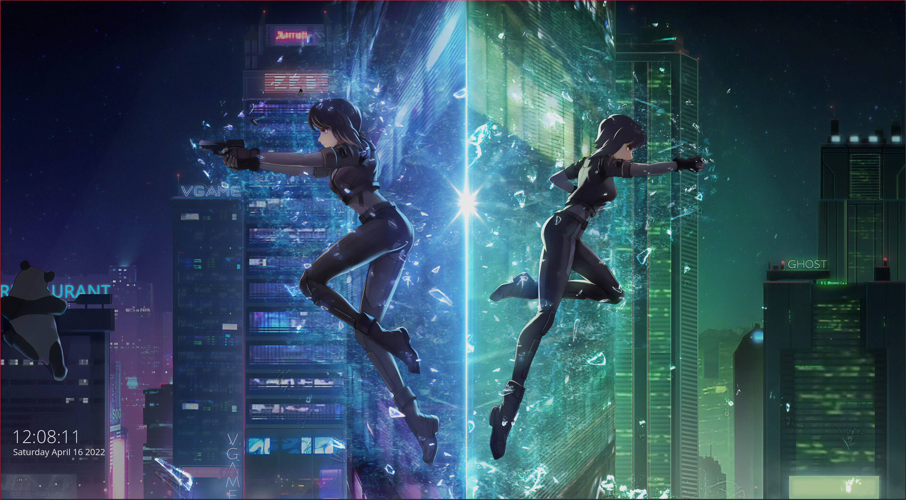
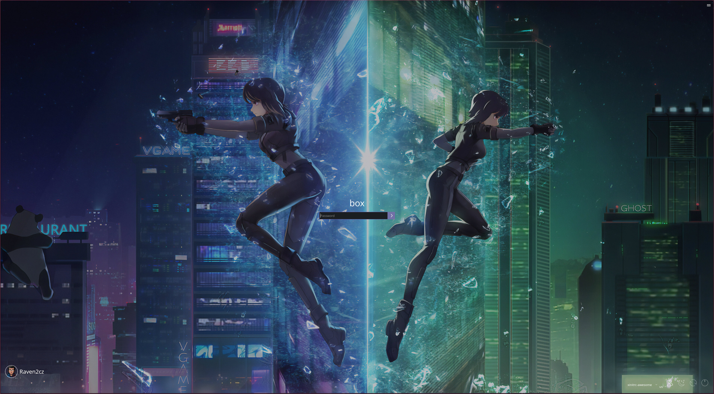

# sddm-ghost
The Simple Desktop Display Manager (SDDM) a display manager. Based on Qt-Components and QLM.

Simple Desktop Display Manager (SDDM) is a display manager (a graphical login program and session manager) for the X11 and Wayland windowing systems. SDDM was written from scratch in C++11 and supports theming via QML.

## SDDM: Ghost in the Shell Theme





## Installation
Just copy it to folder `/usr/share/sddm/themes/sddm-ghost`

For example:
```
mkdir -p ~/git/github/sddm-ghost
cd ~/git/github/sddm-ghost
git clone git@github.com:raven2cz/sddm-ghost.git
sudo cp -R ~/git/github/sddm-ghost/ /usr/share/sddm/themes/
```
* Recommended resolution 4K.
* Select new SDDM GHOST theme in KDE Settings > Startup and Shutdown.
* Alternative (better) - Change your KDE SDDM Settings in `/etc/sddm.conf.d/kde_settings.conf`:
```
  [Theme]
  Current=sddm-ghost

  [X11]
  EnableHiDPI=true
  ServerArguments=-nolisten tcp -dpi 120
```

## Licenses
* License: [MIT](LICENSE)
* Based-on:
 * [Lavender-SDDM](https://www.gnome-look.org/p/1457355/),
 * [Kameleon SDDM by rwml](https://store.kde.org/p/1318060)
